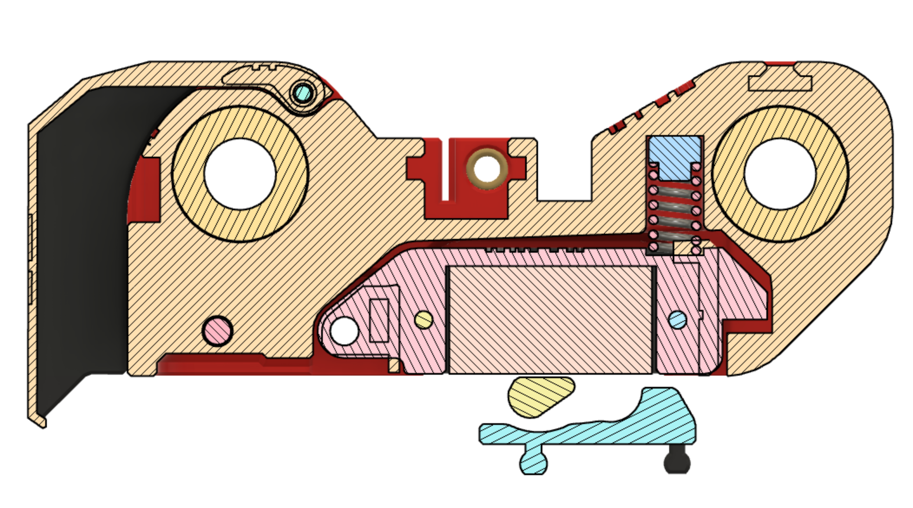
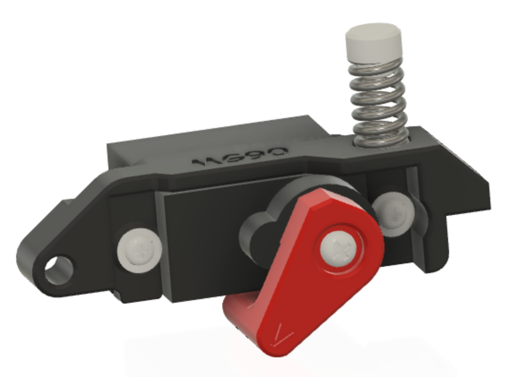
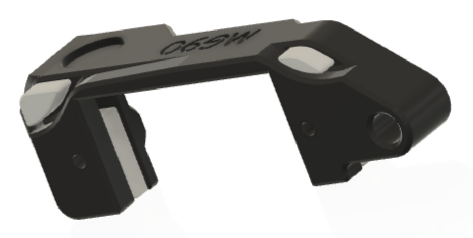
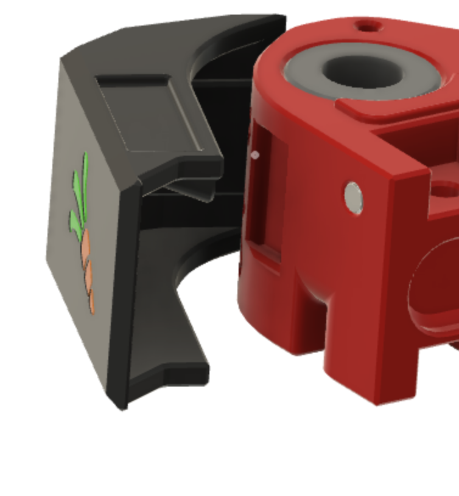
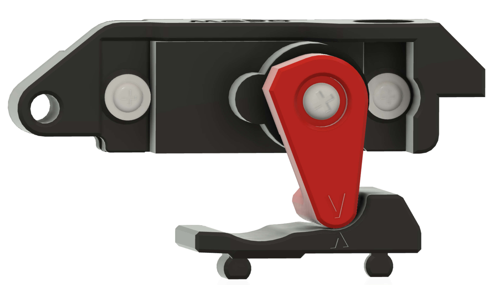

# ERCF-Springy (BETA)

ERCF "Springy" is a modification/upgrade to the ERCF v1.1 design.  One of the problems with ERCF is tuning the grip on the filament by swapping out different sized "top-hats" until sufficent grip is found.  This is a hassle and, although mostly works, the problem is that the flexible nature of the connection of filament blocks and the fact that the servo arm wears over time means that it isn't reliable.  Enter "Springy"...

Springy is a reworked Selector Cart (and ancillary components) with built in articulated sprung servo.  The whole servo assembly moves to ensure consistent pressure to grip the filament and works with a single "universal" top-hat.

Also check out my other ERCF projects:
<ul>
<li>Happy Hare v3 software (https://github.com/moggieuk/ERCF-Software-V3)
<li>KlipperScreen Happy Hare Edition (https://github.com/moggieuk/KlipperScreen-Happy-Hare-Edition)
</ul>

Also, some folks have asked about making a donation to cover the cost of the all the coffee I'm drinking.  I'm not doing this for any financial reward but it you feel inclined a donation to PayPal https://www.paypal.me/moggieuk will certainly be spent making your life with ERCF more enjoyable.

Thank you!

## "Springy" Internals
This cross section reveals how Spring works.  The servo (both MG90S and Savox SH255mg are supported) pivots and provides about 2-3mm of movement.  The updated servo arm design aligns with the new universal top hat and ensures constant grip with varying distances and servo arm wear.

Other changes / notes:
<ul>
<li>The "Idler Block" at the end of the 8mm rods will need to be replaced to provide an enlarged pocket for servo movement.
<li>You must replace all your top-hats with the "universal" design supplied.
<li>The selector door has been strengthed in the hinge area and now locks with two 2x3mm magnets.
<li>Articulated servo mounts are provided for both the popular MG90S and Savox servo options.
<li>Either 12mm or 15mm springs can be used. If you use the shorter 12mm spring, a "spring extender" is included to lengthen to the required 15mm.  You could print this at different scales if necessary to adjust to other 6mm springs you have handy.  You do want the 1mm s/steel wire size though to provide the correct pressure.
</ul>

## Parts needed

### Printed Parts
In addition to the selector cart it is important to print and fit a new "Idler Block" to ensure the servo will not bind and wires have room to move. Also make sure you use the new top-hat and correct servo arm (the MG90S and Savox are different spline patterns!)

### Hardware
<ul>
<li>1x M3x12mm SHCS bolt for articulated servo pivot
<li>1x M3x6mm SHCS bolt to replace 8mm used to secure encoder
<li>1x 12mm or 15mm s/s compression spring.  This should be a 6mm diameter, 1mm wire compression spring.  Both will work and the 12mm is commonly supplied in extruder kits.So you might have one lying around
<li>2x 3x2mm round neodymium magnets.  These are optional if you want the updated cover to lock shut.
<li>2x M2x8mm self tapping "servo" screws (these are the ones that were probably supplied with servo). Note the warning about too long screws below.

Here is the articulated servo mount showing the MG90S servo verion and a 12mm spring (and therefore the 3mm spring extender). The Savox mount is slightly different. Don't fit spring extender when using 15mm long spring.

## Assembly

* Dissassembly: Remove the 6mm selector belt and separate the 8mm rods from the "Idle Block" end.  Remove the Encoder from the Selector Cart.  Remove the old Selector Cart from the 8mm rods.

* Make sure to replace the Idle Block with the new one.
  
* The servo mounts have break away suppports (MG90S has 4, Savox has 2) shown in grey below.  [Note: The print orientation is chosen to ensure strengh in the hinge area]. The M3 brass inserts are the same as the original with one exception.  The insert that forms the pivot for the servo should be set 1mm BELOW the surface.  The new STL has provision for this.

  
* Fit the servo with two M2x6mm (or 8mm) self tapping screws.  IMPORTANT: Make sure the screws don't poke through to the other side. If they do, remove then and file then slightly before refitting. I found the screws supplied by the servo vendors fitted but others can be a little long.

* Break away the 3 numbered supports from the Selector Cart.  Fit the spring (and spacer if necessary) into the cart.  Insert the servo assemply spring side first then depress the pivot side and secure the servo pivot with a M3x12mm SHCS bolt -- it should just reach the backside of the brass insert.

It should articulate similar to this video: (https://www.youtube.com/shorts/Brj2L9Y7NeA)

* Add back the encoder changing the one M3x8mm to a M3x6mm SHCS (fits into the other side of the brass insert shared with the servo pivot).
  
* Secure the servo wiring as shown in the picture.  The *small* loop will provide necessary free movement to prevent strain on the wire. **Don't fit the servo arm at this stage.**

 

* Reassemble ERCF and reconnect wiring.

* Replace all the Top Hats with the universal one supplied in this repo (they have a v2.0 printed on the top edge)

* Insert a 3x2mm magnet into the new stronger connector cover and corresponding hole on the selector cart
  
   

* Once ERCF is operational again, align the selector with one of the gates. Run `ERCF_SERVO_UP` to ensure the servo is in the up position.  Fit the new servo arm (Savox version has "S" on arm, MG90S is blank) on the spine that best holds the arm against the servo body (fine adjustments can be made later to the servo angle in `ercf_parameters.cfg`)

* Run `ERCF_SERVO_DOWN` or `ERCF_TEST_SERVO VALUE=xxx` to find the angle where the `V` on the servo arm aligns with the tiny `^` on the Top Hat.  This eliminates any judgement and represents the best location for the down position. **NOTE: the angle of movement is a little bit smaller that before, so don't assume your existing value is correct - test again carefully working up to the correct postion!:w
  **

Now enjoy more reliable and hopefully less filament slippage.   Note: This removes one or two variables from your setup -- friction in the filament path can still lead to problems.

Good luck.  You can find me on Discord as `moggieuk#6538`

    (\_/)
    ( *,*)
    (")_(") ERCF Ready
  
